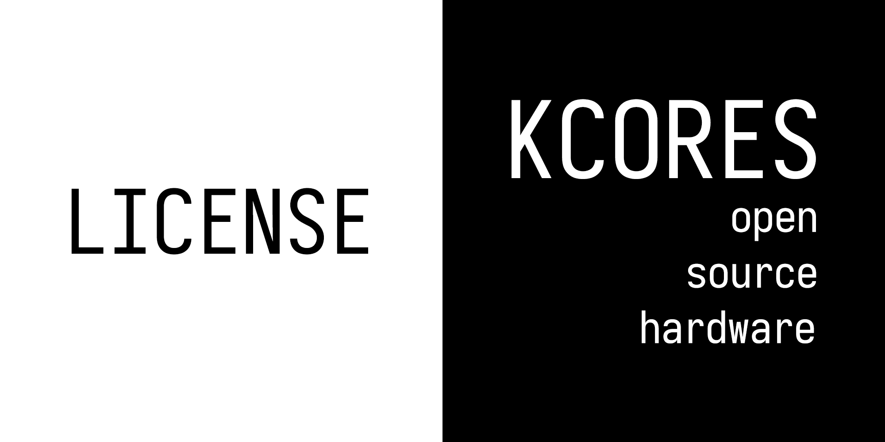

KCORES 许可证
-------------

# 许可证下载

- [中文版本许可证](./LICENSE_zh-CN)

# 说明

KCORES 许可证的目的是聚集开源硬件爱好者, 帮助使用 KCORES 许可证的开源项目进行孵化和宣传, 建立一个大家都喜爱的开源硬件组织.  

简单来讲, 该许可证基于 MIT 许可证修改而来 (其实更像 GPL), 但与 MIT 许可证不同的地方是:   

- 使用该许可证的开源项目必须附带该许可证并注明参与了KCORES开源硬件项目.  
- 使用该许可证的开源项目必须在其产品或衍生品 (比如打印的PCB) 上面的明显位置清晰的注明项目源作者版权信息和"KCORES"字样.  
- 使用该许可证的开源项目必须在其编译后的软件界面上注明项目源作者版权信息和"KCORES"字样.
- 使用本许可证的开源项目的每个再散布或衍生副本都必须开放源代码和源文件, 且不可更改协议.  

众人拾柴火焰高, KCORES 许可证为了保护原创作者的劳动成果和提升社区的宣传力量, 因此强制要求将这二者标记到产品上来达到宣传效果.  

有更多的人关注 KCORES 开源硬件项目, 开源硬件项目才会有更多的使用者和曝光度, 才会真正流行起来, 我们才能够组建真正良好和强大的开源硬件社区, 才会孵化和产出更好的开源硬件项目.  

同时, KCORES 许可证是一种类似 GPL 的感染性协议, 制定这样的规则的原因是, 闭源硬件让我们别无选择, 奸商们只会盗取开源作者的设计, 去掉版权信息后拿去赚钱.  

我们并不反对拿开源硬件去赚钱, 使用开源硬件设计方案为大家代工是造福不会动手或懒得动手的大众的行为, 值得鼓励, 劳动报酬是劳动者应得的回报.   

我们反对的是盗取劳动成果, 侵犯版权, 闭源修改对开源项目价值进行榨取和侵犯的行为.  

于是, 我们制定了 KCORES 开源硬件协议.  

我们只有去进攻, 去感染, 才能为开源硬件争取到一席之地, 才不会被闭源硬件倾轧致死.  

想要万兆网卡? 自己打印! 想要键盘? 自己焊接! 想要CPU? 自己烧FPGA! 想要电脑? 全部开源自己造!  

终有一天, 垃圾佬们, 硬件爱好者们, Geek们, 硬件开发者们, 软件开发者们, 广大的电子产品使用者们, 不再会受制于闭源的商业产品, 而是多出一种选择, 那就是 KCORES 开源硬件产品!  

**全世界的开源硬件爱好者们, 联合起来!**  

# 徽章, 吧唧

自豪地采用 KCORES 许可证, 为你的项目戴上徽章吧! 徽章文件在这里 [kcores-open-source-license-bandge](./bandge/kcores-open-source-license-bandge.png).  

# KCORES 是什么?

简单来讲, KCORES 是一个开源硬件组织. 详见: [https://github.com/KCORES/all-about-kcores](https://github.com/KCORES/all-about-kcores).  

